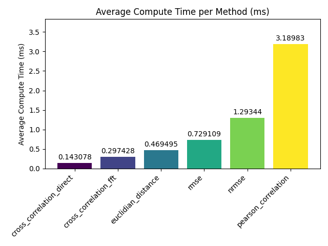
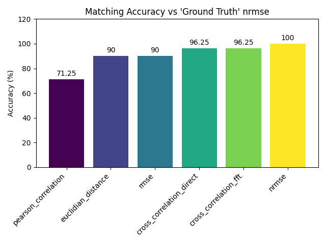
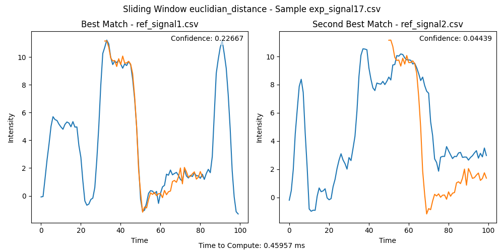
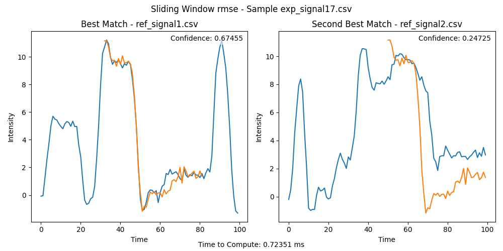
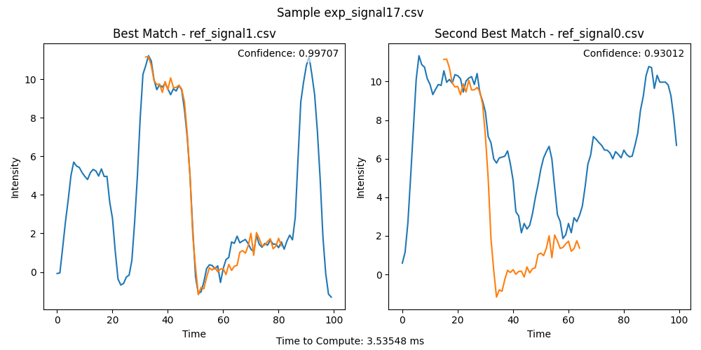
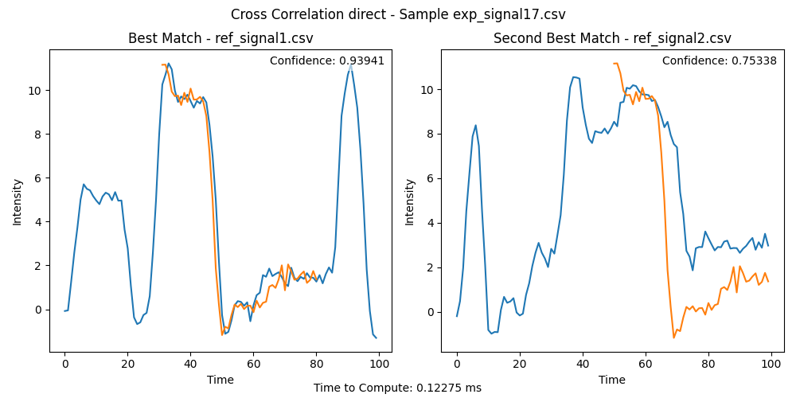
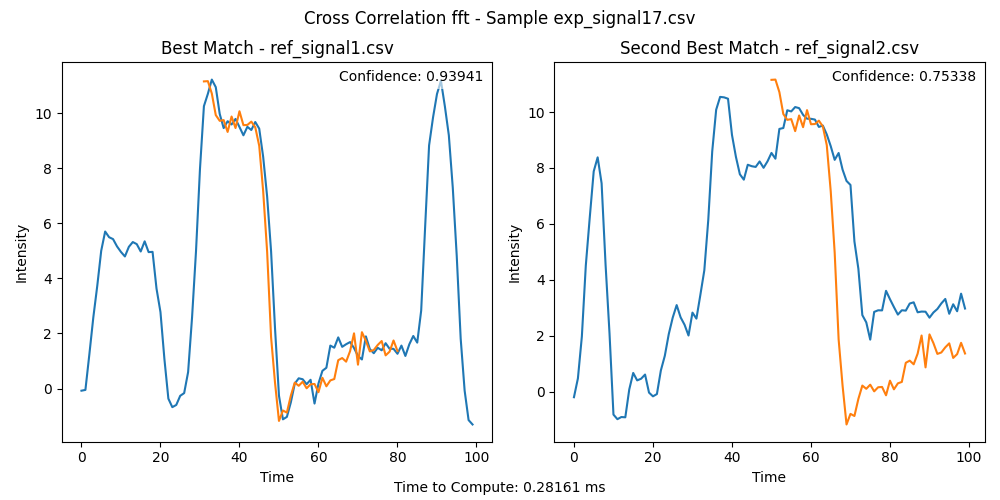

# signal-matching

Python implementation of signal matcher. Estimates best two matches of a short, noisy signal to a longer signal from a set of references.

## Usage

To use the signal matcher, first install the required Python libraries.
```bash
python3 -m venv venv
source venv/bin/activate
pip install -r requirements.txt
```

To visualize the reference signals, run `scripts/plot_references.py`.
For solving with all of the sliding window methods, run `scripts/sliding_window.py`.
For solving with all of the cross correlation methods, run `scripts/cross_correlation.py`.
To analyze the results from the solving scripts, run `scripts/analysis.py`.

To solve matches for an arbitrary data set:

```python
from signal_matcher.signal import Signal
from signal_matcher.solver import Solver

# Creating a solver loads all signal data from the provided directories,
# this loads signal data from .csv's that include time and intensity (see data/ for examples)
solver = Solver('path/to/samples', 'path/to/references')

# Call a solve method to find the best matches for each sample from the references
results = solver.cross_correlation_solve(Signal.nrmse, visualize=True)
```

## Implementation

To implement the signal matcher, I began by making generic representations of the signal data and generating some simple loading code for processing the dataset. With this, I had a basis to begin experimenting with algorithms.

My first inclination for solving the actual matching problem was to use a brute force algorithm. Since the samples are shorter in time than the reference data, it is not as simple as comparing the signals one-to-one. Thus, to brute force it, we can instead check every possible match for a sample with every possible reference signal. To do so, I began by implementing a 'sliding window' algorithm, wherein matches would be generated by looping over every possible window in time of the same length as the sample.

From there, however, I had to decide how to evaluate the similarity of the sample with the windowed reference. The first thing that came to mind was simply calculating the distance between each point of intensity in the two signals. With a metric for roughly evaluating the similarity, I could use that as a confidence metric to not only find the best window match in a given reference, but find the two best overall matches from each reference.

The simple Euclidean distance was able to generate matches, and plotting the samples ontop of the reference it was matched to, it looked mostly good, but my confidence metrics were very low due to the inherent noise and large(ish) sample rate. This appeared to skew some of the results, wherein an eyeball test told be I could likely improve. I then moved on to testing with the root mean square error (RMSE), which I hoped would improve the skew by standardizing the data. While this did, in fact, look to be better, and generated metrics that looked a bit more like probabilities, I still looked to see if I could marginally improve.

This lead me to testing with the normalized root mean square error (NRMSE), as I hoped reducing the influence of the scale of error per point would allow matches to be generated that followed the shape of the reference while still containing noise. In testing this, I was much happier, both with my confidence metrics as well as the matching itself. Using the NRMSE, it looked like all of the sample's best matches were correct, or at least as correct as could be generated. Signals that were almost exactly the same as the reference had very large confidence metrics, while those that were obviously very different had much lower scores.

Once I was happy with the algorithm, I cleaned up the implementation and created a script to run experiments with all of the confidence metrics and save the results in a nicer format. I was not, however, fully satisfied. Each improvement of the similarity metric increased the runtime constants of the algorithm quite considerably, not to mention the time complexity was likely the worst it could reasonably be. For evaluating an individual sample (assuming all the references are the same length), the time complexity is O(N * M^R), where N is the length of the sample, M is the length of a reference, and R is the number of references.

In search of optimizations, I researched into other algorithms designed for this purpose. What was most interesting to me were those that operated not in the time domain, but in the frequency domain. Trading off the time for computing a Fourier transform can be leveraged to compute an answer for the entire time space at once, removing the rapid growth introduced by the windowing implementation. The most prominent of these solutions I found was cross correlation. While this method can be done in the time domain, also using windowing, it can also be computed on the frequency domain.

Implementing cross correlation for matching, I utilized an existing implementation from `scikit-learn`. Their algorithm, unless configured otherwise, uses a sliding window for small length vectors and the fast-Fourier transform (FFT) for larger signals. Since my understanding of the underlying algorithm is somewhat low, I was unable to figure out a nice way to generate a confidence value directly from the cross correlation output, so I used my existing metrics. While likely more costly, running the similarity check once per reference after already finding the best match with the cross correlation was a significant improvement both to runtime constants and time complexity.

The cross correlation algorithm appeared to perform just as well as the brute force, while taking as little as a 10th of runtime per sample. This, to my surprise, also held true for the windowed method. Not only that, the windowed method was faster than the FFT method. Beyond the cost ofperforming the FFT, I don't have a great explanation of that, other than `scipy` likely is implemented in C/C++ and is not paying the tax of looping on top of the Python interpreter.
In researching cross correlation, I found something that referenced the Pearson correlation and equated it performing cross correlation on two samples of the same length. This lead me to test my brute-force algorithm with it as a metric, which not only performed by far the slowest, but generated some results that were noticably worse than other metrics.

## Analysis

Once all the algorithms were implemented, I collected data for each and performed some analysis. As expected, the brute-force algorithms were the slowest, with each subsequently more complex metric making the computation slightly longer. Since they have equivalent time complexity, I would expect over many more and much longer reference signals the runtimes would converge. The cross correlation methods performed extremely fast, with the best overall being the 'direct', or sliding window approach. While I can't explain why its so significantly better, it does make sense that with relatively short reference signals the cost of the FFT would outweight the time complexity improvements.



Without an actual ground truth, I used what I perceived to be the best results to be the 'correct' answers. With this, I calculated the relative accuracy of the best and second best match determinations, which showed that the NRMSE did in fact 'improve' on the Euclidean distance and RMSE, while the speedup of the cross correlation seems to have been at a small cost of accuracy.



### Example Output













## Futures

Given more time to expand on this, I'd be interested to explore more frequency domain algorithms, such as dynamic time warping (DTW, specifically FastDTW), although for DTW in particular it seems to mostly benefit when the speed of two signals may be different, which doesn't seem super applicable to the dataset. It also may be interesting to explore machine learning methods for identifying matches, trading off some precision and training time for likely faster runtime analysis.

If I were to explore building this into a larger application, I'd also be interested to explore methods for hashing signals. Applications like Shazam condense signals into frequency domain based hashes to increase lookup speed, as they perform signal matching across a massive database of very large references. Piggybacking off of that idea, it would be fun, even without introducing further optimization, to experiment with extending the Signal class to be created from common audio formats and to build a small backend for matching against a database of songs or audio files. This could be paired with a simple frontend to record user input from a microphone to identify songs.
